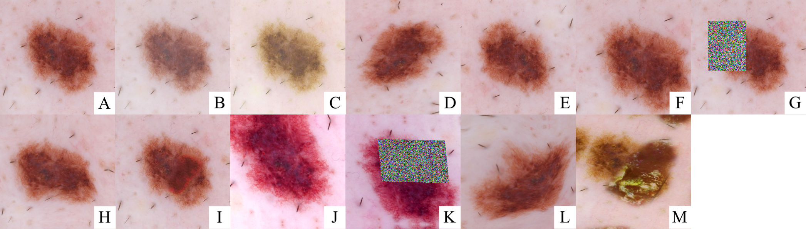

# Data Augmentation for Skin Lesion Analysis



This project contains the source code of all experiments described in
'Data Augmentation for Skin Lesion Analysis.'


## Abstract

> Deep learning models show remarkable results in automated skin lesion
> analysis. However, these models demand considerable amounts of data, while the
> availability of annotated skin lesion images is often limited. Data
> augmentation can expand the training dataset by transforming input images. In
> this work, we investigate the impact of 13 data augmentation scenarios for
> melanoma classification trained on three CNNs (Inception-v4, ResNet, and
> DenseNet). Scenarios include traditional color and geometric transforms, and
> more unusual augmentations such as elastic transforms, random erasing and a
> novel augmentation that mixes different lesions. We also explore the use of
> data augmentation at test-time and the impact of data augmentation on
> various dataset sizes. Our results confirm the importance of data augmentation
> in both training and testing and show that it can lead to more performance
> gains than obtaining new images. The best scenario results in an AUC of 0.882
> for melanoma classification without using external data, outperforming the
> top-ranked submission (0.874) for the ISIC Challenge 2017, which was trained
> with additional data.


## Project setup

1. Install OpenCV with `pip3 install opencv-python`.
2. Run `pip3 install -r requirements.txt`.
3. Download data from [ISIC 2017: Skin Lesion Analysis Towards Melanoma Detection](https://challenge.kitware.com/#challenge/583f126bcad3a51cc66c8d9a).
   - Data should be downloaded from the three phases of 'Part 3: Lesion Classification' ([training](https://challenge.kitware.com/#phase/5840f53ccad3a51cc66c8dab), [validation](https://challenge.kitware.com/#phase/584b0afacad3a51cc66c8e33), [testing](https://challenge.kitware.com/#phase/584b0afccad3a51cc66c8e38). Registration is required.


## Train

To make train faster, we resize every image (train, validation and test) to a
maximum width or height of 1024 pixels. This will make augmentation operations
(e.g. resizing, random crop) run faster.
[ImageMagick](http://imagemagick.org/script/index.php) can do the trick:

```
cd ISIC-2017_Training_Data
mkdir 1024
convert "*.jpg[1024x>]" -set filename:base "%[base]" "1024/%[filename:base].jpg"
```

The project uses [Sacred](http://sacred.readthedocs.io) to organize the
experiments. The main script for training is in the `train.py` file. Check the
available settings by running `python3 train.py print_config`.

#### Example: training Inception-v4 in scenario J

```
TRAIN_ROOT=/work/datasets/ISIC-2017_Training_Data_1024
TRAIN_CSV=/work/datasets/ISIC-2017_Training_Part3_GroundTruth.csv
VAL_ROOT=/work/datasets/ISIC-2017_Validation_Data_1024
VAL_CSV=/work/datasets/ISIC-2017_Validation_Part3_GroundTruth.csv
TEST_ROOT=/work/datasets/ISIC-2017_Test_v2_Data_1024
TEST_CSV=/work/datasets/ISIC-2017_Test_v2_Part3_GroundTruth.csv

python3 train.py with \
    train_root=$TRAIN_ROOT train_csv=$TRAIN_CSV \
    val_root=$VAL_ROOT val_csv=$VAL_CSV \
    test_root=$TEST_ROOT test_csv=$TEST_CSV \
    model_name='inceptionv4' \
    epochs=120 \
    'aug={"color_contrast": 0.3, "color_saturation": 0.3, "color_brightness": 0.3, "color_hue": 0.1, "rotation": 90, "scale": (0.8, 1.2), "shear": 20, "vflip": True, "hflip": True, "random_crop": True}' \
    --name inceptionv4-scenario-j
```

If everything goes well, Sacred will create a directory with a unique ID inside
`results` (e.g. `results/1` for the first run). Inside this directory, you will
find:

* `config.json`: Sacred configuration used in training.
* `cout.txt`: Entire stdout produced during the training.
* `run.json`: General metadata of the training.
* `train.csv`: CSV with metrics on train set.
* `val.csv`: CSV with metrics on validation set.
* `checkpoints/model_best.pth`: model with the best validation AUC.
* `checkpoints/model_last.pth`: model as in the last epoch.
* `images/*`: sample images to debug augmentations.

`results/results.csv` contains information about all successful trains.

Each training will also run i) test without augmentation, ii) test data
augmentation, iii) 144-crop test.

### Telegram API

If you want to monitor the experiments with Telegram (receive a message when
the experiments start, finish, or fail), create a file `telegram.json` at the
root of the project:

```
$ cat telegram.json
{
    "token": "00000000:XXXXXXXXXXXXXXXXXXXXXXXXXXXXXXXX",
    "chat_id": "00000000"
}
```

To configure the Telegram API, check [this](https://stackoverflow.com/questions/32423837/telegram-bot-how-to-get-a-group-chat-id).


## Test

Each model file (i.e, `model_best.pth` or `model_last.pth`) contains the
PyTorch model, weights, and augmentation configuration (accessed through
`model.aug_params`). To load the model, use `torch.load`.

The `test.py` file will automatically infer the augmentation settings from the
model. Run `python3 test.py --help` to check all available options.

#### Example: test the model with augmentation on test (with 32 augmented replicas)

```
python3 test.py results/1/checkpoints/model_best.pth $TEST_ROOT  $TEST_CSV -n 32 -o output.csv
```


## Mix lesions

To generate mix lesions, use the `generate_lesions.py` script. To generate
lesions similarly to the paper (sigma = 20), run:

```
TRAIN_CSV=dataset/ISIC-2017_Training_Part3_GroundTruth.csv
TRAIN_DIR=dataset/ISIC_2017/
python3 generate_lesions.py $TRAIN_CSV $TRAIN_DIR 42000 --sigma 20 --output mix_lesion_images
```

Note: `$TRAIN_DIR` must contain two sub-directories: `images` (with all lesion
JPGs) and `masks` (with all lesion segmentation masks PNGs).


## Reproducing the paper

1. Set the data directories:

```
TRAIN_ROOT=datasets/ISIC-2017_Training_Data_1024
TRAIN_CSV=datasets/ISIC-2017_Training_Part3_GroundTruth.csv
VAL_ROOT=datasets/ISIC-2017_Validation_Data_1024
VAL_CSV=datasets/ISIC-2017_Validation_Part3_GroundTruth.csv
TEST_ROOT=datasets/ISIC-2017_Test_v2_Data_1024
TEST_CSV=datasets/ISIC-2017_Test_v2_Part3_GroundTruth.csv
```

2. Run all limited data experiments:

```
./experiments/run-limit-data.sh
```

3. Run all augmentation experiments (except mix lesions):

```
./experiments/run-aug-scenarios.sh
```

3. Run mix lesions experiments:

Set `TRAIN_ROOT` and `TRAIN_CSV` to include the mix lesions images.

```
TRAIN_ROOT=datasets/ISIC-2017_Training_Data_1024
TRAIN_CSV=datasets/ISIC-2017_Training_Part3_GroundTruth.csv
./experiments/run-mix-lesions.sh
```

## Cite

If you use this code, please cite us:

```
@incollection{perez2018data,
  title={Data augmentation for skin lesion analysis},
  author={Perez, F{\'a}bio and Vasconcelos, Cristina and Avila, Sandra and Valle, Eduardo},
  booktitle={OR 2.0 Context-Aware Operating Theaters, Computer Assisted Robotic Endoscopy, Clinical Image-Based Procedures, and Skin Image Analysis},
  pages={303--311},
  year={2018},
  publisher={Springer}
}
```
